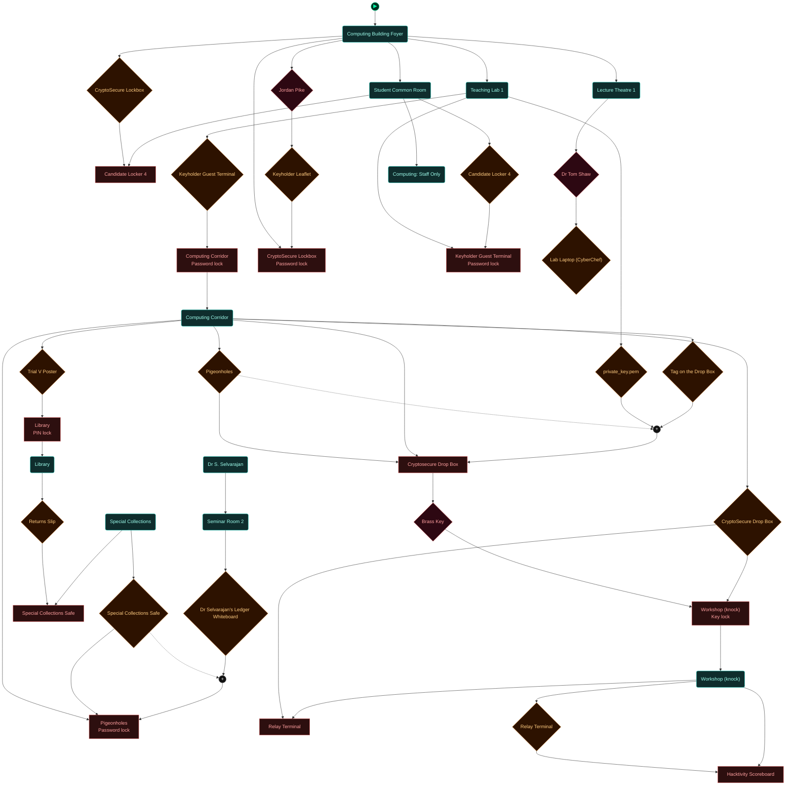
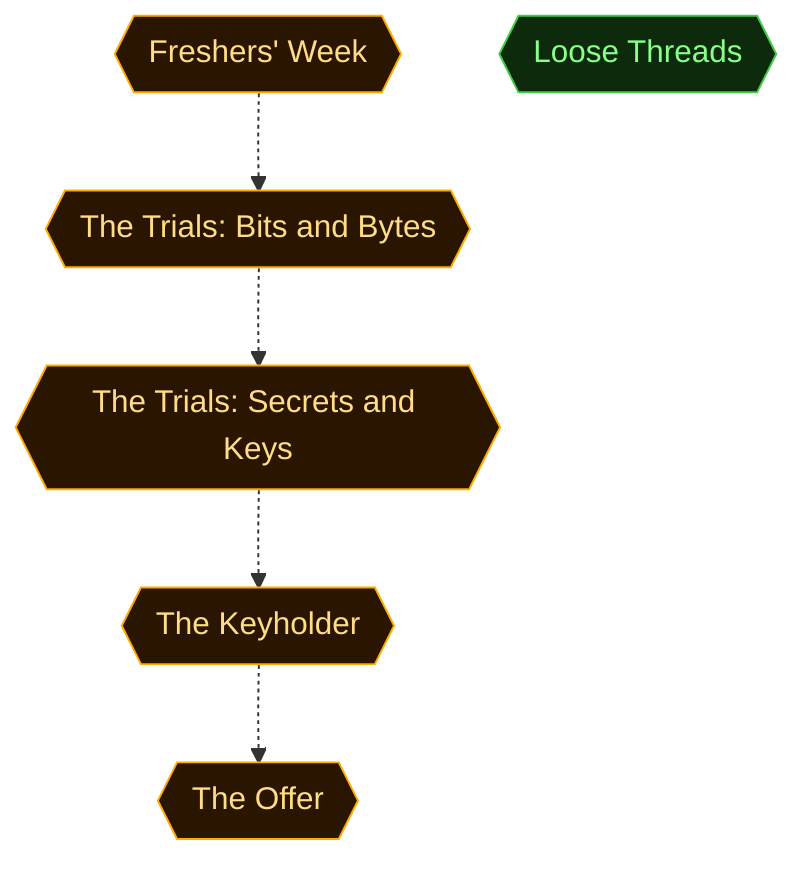
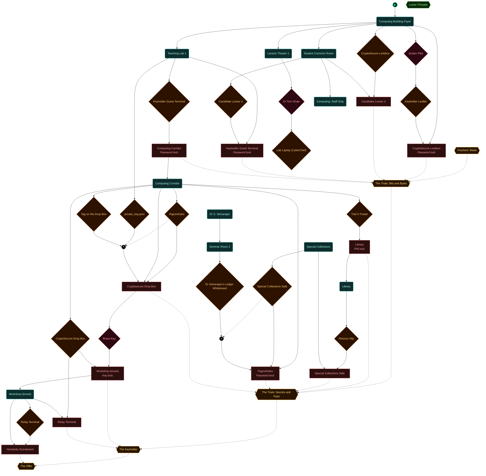
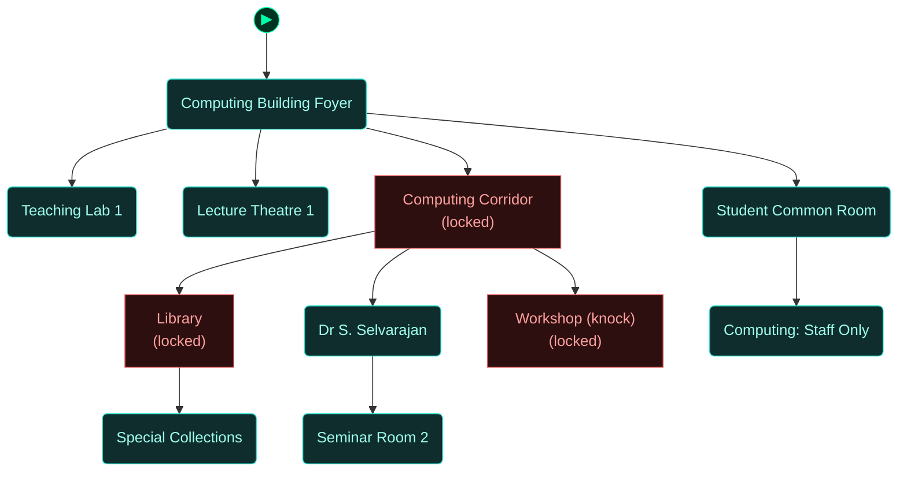

<!-- Auto-generated by scripts/generate_dungeon_graph.rb — do not edit by hand -->

# lab_tesseract_trials — Scenario Graph Reference

Freshers' week at Miskatonic University UK. CryptoSecure Recovery, the front for Ransomware Incorporated, is talent-spotting first-years through a puzzle trail called the Keyholder Trials. You're undercover as a student. Get picked. Every Trial opens with something you decode in CyberChef: get a lab laptop from Dr Shaw in the lecture theatre first. If your phone is ever compromised, submit what HaX most needs to know as a flag on a Hacktivity terminal (lower case, exactly as found); the one in this building is in Dr Schreuders' workshop.

## Scenario Statistics

| Metric | Value |
|---|---|
| Story aims | 6 |
| Total tasks | 18 (4 optional) |
| VM flag challenges | 0 |
| Physical locks | 11 |
| AND-gate convergences | 2 |
| Rooms | 11 |
| Puzzle graph nodes / edges | 41 / 52 |
| Story graph nodes / edges | 6 / 4 |

## Critical Path

4 hops through story aims — minimum mandatory sequence to reach mission completion:

**Freshers' Week → The Trials: Bits and Bytes → The Trials: Secrets and Keys → The Keyholder → The Offer**

## How to Read These Diagrams

| Shape | Colour | Meaning |
|---|---|---|
| Rounded rectangle | Teal | Room / physical area |
| Rectangle | Red | Lock, barrier, or interactive terminal |
| Diamond | Orange | Inventory item or credential |
| Diamond | Red/Pink | NPC or physical key |
| Diamond | Purple | VM flag (challenge completion token) |
| Rectangle | Blue | VM challenge |
| Ribbon | Amber | NPC conversation / action gate |
| Hexagon | Green | Story aim (objective) |
| Hexagon | Amber | Critical path node |
| Circle | Grey | AND gate (all inputs required) |
| Subroutine rect `[[…]]` | Green | Container (holds items) |
| Rounded rectangle | Amber | NPC in room (Rooms & Contents only) |

Edges: `-->` solid = hard dependency; `-.->` dashed = soft / narrative dependency or optional path.

The `▶` node marks the player's starting room.

## Puzzle Graph

Physical lock–key dependency chain. Shows which items, codes, and NPC interactions are required to open each lock, and which locks gate access to each room or object. Use this to trace solvability, spot circular dependencies, and check that every key is reachable before the lock that needs it.

## Story Aims

Narrative objective flow. Shows story aims and their unlock conditions. Critical path aims are highlighted in amber. Use this to check aim sequencing, identify gaps between objectives, and verify that the player always has a clear next goal.

## Story + Puzzle (Integrated)

Puzzle graph and story aims combined, with bridge edges connecting physical puzzle progress to story aim completion. Use this to verify that physical actions drive narrative progress and that no aim is left floating without a puzzle prerequisite.

## Rooms

Physical room layout with all connections. Locked rooms are shown in red. Use this to check room reachability, identify dead-end rooms with no content, and understand the spatial structure of the scenario.

## Rooms & Contents

Physical room layout with all objects, containers, NPCs, and held items. Use this to check clue distribution across rooms, verify that hints are placed before the locks they solve, and spot rooms that are under- or over-loaded with content.

```mermaid
flowchart TD

  classDef room      fill:#0f2d2d,stroke:#22ddcc,color:#a0ffee
  classDef lock      fill:#2d0f0f,stroke:#e66060,color:#ffa0a0
  classDef key       fill:#2d0812,stroke:#e66060,color:#ffa0a0
  classDef item      fill:#2d1200,stroke:#e89030,color:#ffcc80
  classDef gate      fill:#111,stroke:#666,color:#eee
  classDef vm        fill:#0c1f40,stroke:#4a90d9,color:#a0c8ff
  classDef flag      fill:#1a0c2d,stroke:#9060d0,color:#cc99ff
  classDef action    fill:#1a1200,stroke:#cc9922,color:#ffee88
  classDef aim       fill:#0d2a0d,stroke:#44cc44,color:#88ff88
  classDef aim_gate  fill:#111111,stroke:#44cc44,color:#44cc44
  classDef container fill:#1a2d1a,stroke:#60b060,color:#a0e0a0
  classDef npc       fill:#2d1f0d,stroke:#d0a050,color:#ffe0a0
  classDef critical  fill:#2a1500,stroke:#ffaa00,color:#ffdd88
  classDef start     fill:#003322,stroke:#00ffaa,color:#00ffaa

  node_start(("▶"))
  node_start --> foyer

  foyer("Computing Building Foyer")
  teaching_lab("Teaching Lab 1")
  lecture_theatre("Lecture Theatre 1")
  common_room("Student Common Room")
  corridor["Computing Corridor<br/>(locked)"]
  library["Library<br/>(locked)"]
  special_collections("Special Collections")
  sidhu_office("Dr S. Selvarajan")
  seminar_room("Seminar Room 2")
  workshop["Workshop (knock)<br/>(locked)"]
  staff_office("Computing: Staff Only")
  rc_byte_wall_1{"The Byte Wall (1979 front panel)"}
  rc_display_plaque_2{"Display Plaque"}
  rc_powers_of_two_poster_3{"Poster: Powers of Two"}
  rc_ascii_chart_4{"ASCII Chart Handout"}
  rc_paper_tape_5{"Punched Paper Tape (1979)"}
  rc_cryptosecure_lockbox_6[["CryptoSecure Lockbox"]]
  rc_keyholder_device_7{"Keyholder Device"}
  rc_trial_ii_card_8{"Trial II Card"}
  rc_signup_laptop_9{"CryptoSecure Sign-up Laptop"}
  rc_npc_agent_hax_10("Agent HaX")
  rc_comms_discipline_11{"Comms Discipline"}
  rc_npc_agent_hax_12("Agent HaX")
  rc_fn04_base64_13{"Field Note 4: Base64"}
  rc_fn05_layers_caesar_14{"Field Note 5: Layers and Caesar"}
  rc_fn06_vigenere_15{"Field Note 6: Vigenère"}
  rc_fn07_hax_16{"Field Note 7: Hashes"}
  rc_fn08_aes_17{"Field Note 8: AES"}
  rc_fn09_public_key_18{"Field Note 9: Public Keys"}
  rc_fn10_hax_19{"Field Note 10: Signatures"}
  rc_fn11_text_encodings_20{"Field Note 11: EBCDIC"}
  rc_comms_discipline_hax_21{"Comms Discipline"}
  rc_npc_keyholder_22("Keyholder")
  rc_npc_agent_hax_23("Agent HaX")
  rc_npc_jordan_pike_24("Jordan Pike")
  rc_keyholder_leaflet_25{"Keyholder Leaflet"}
  rc_lab_account_pc_26[["Your Lab Account"]]
  rc_private_key_pem_27{"private_key.pem"}
  rc_public_key_pem_28{"public_key.pem"}
  rc_lab_readme_29{"README.txt"}
  rc_keyholder_guest_terminal_30[["Keyholder Guest Terminal"]]
  rc_trial_iv_hex_31{"trial_iv.hex"}
  rc_tom_board_32{"Dr Shaw's Whiteboard"}
  rc_npc_dr_tom_shaw_33("Dr Tom Shaw")
  rc_lab_laptop_34{"Lab Laptop (CyberChef)"}
  rc_fn01_bits_bytes_bases_35{"Field Note 1: Bits, Bytes, Bases, CyberChef"}
  rc_fn02_ascii_encodings_36{"Field Note 2: Characters Are Numbers"}
  rc_fn03_hex_37{"Field Note 3: Hex and Binary"}
  rc_candidate_locker_4_38[["Candidate Locker 4"]]
  rc_trial_iii_card_39{"Trial III Card"}
  rc_common_noticeboard_40{"Common Room Noticeboard"}
  rc_common_vending_machine_41{"Snack Machine"}
  rc_coffee_station_42{"Coffee Station"}
  rc_cliffe_laptop_43{"Dr Schreuders' Laptop"}
  rc_npc_megan_oyelaran_44("Megan Oyelaran")
  rc_npc_dr_z_cliffe_schreuders_45("Dr Z. Cliffe Schreuders")
  rc_trial_v_poster_46{"Trial V Poster"}
  rc_pigeonholes_47[["Pigeonholes"]]
  rc_pigeonhole_2_48{"Pigeonhole 2"}
  rc_pigeonhole_3_49{"Pigeonhole 3"}
  rc_pigeonhole_4_50{"Pigeonhole 4"}
  rc_pigeonhole_5_51{"Pigeonhole 5"}
  rc_cryptosecure_drop_box_52[["CryptoSecure Drop Box"]]
  rc_brass_key_53{"Brass Key"}
  rc_final_trial_card_54{"Final Trial Card"}
  rc_drop_box_tag_55{"Tag on the Drop Box"}
  rc_floor_directory_56{"Floor Directory"}
  rc_returns_slip_57{"Returns Slip"}
  rc_codebreakers_book_58{"The Codebreakers (returned)"}
  rc_special_collections_safe_59[["Special Collections Safe"]]
  rc_trial_vii_txt_60{"trial_vii.txt"}
  rc_candidate_assessments_61{"Candidate Assessments"}
  rc_job_tape_hex_62{"job_0412.hex"}
  rc_sidhu_door_card_63{"Door Card"}
  rc_fn07_desk_copy_64{"Handout: Hashes"}
  rc_ledger_whiteboard_65{"Dr Selvarajan's Ledger Whiteboard"}
  rc_npc_dr_sidhu_selvarajan_66("Dr Sidhu Selvarajan")
  rc_fn07_hashing_67{"Field Note 7: Hashes"}
  rc_fn10_signatures_68{"Field Note 10: Signatures"}
  rc_relay_terminal_69[["Relay Terminal"]]
  rc_report_b64_70{"report.b64"}
  rc_report_sha256_71{"report.sha256"}
  rc_report_sig_72{"report.sig"}
  rc_keyholder_public_pem_73{"keyholder_public.pem"}
  rc_hacktivity_scoreboard_74[["Hacktivity Scoreboard"]]
  rc_submission_accepted_75{"submission_accepted.txt"}
  rc_cliffe_build_screen_76{"Dr Schreuders' Build"}
  rc_npc_dr_z_cliffe_schreuders_77("Dr Z. Cliffe Schreuders")
  rc_staff_photocopier_78[["Staff Photocopier"]]
  rc_staff_list_txt_79{"staff_list.txt"}
  rc_npc_dr_oleg_illiashenko_80("Dr Oleg Illiashenko")
  rc_fn12_mojibake_81{"Field Note 12: Mojibake"}

  foyer --> corridor
  foyer --> teaching_lab
  foyer --> common_room
  foyer --> lecture_theatre
  common_room --> staff_office
  corridor --> workshop
  corridor --> library
  corridor --> sidhu_office
  library --> special_collections
  sidhu_office --> seminar_room
  foyer --> rc_byte_wall_1
  foyer --> rc_display_plaque_2
  foyer --> rc_powers_of_two_poster_3
  foyer --> rc_ascii_chart_4
  foyer --> rc_paper_tape_5
  foyer --> rc_cryptosecure_lockbox_6
  rc_cryptosecure_lockbox_6 --> rc_keyholder_device_7
  rc_cryptosecure_lockbox_6 --> rc_trial_ii_card_8
  foyer --> rc_signup_laptop_9
  foyer --> rc_npc_agent_hax_10
  rc_npc_agent_hax_10 --> rc_comms_discipline_11
  foyer --> rc_npc_agent_hax_12
  rc_npc_agent_hax_12 --> rc_fn04_base64_13
  rc_npc_agent_hax_12 --> rc_fn05_layers_caesar_14
  rc_npc_agent_hax_12 --> rc_fn06_vigenere_15
  rc_npc_agent_hax_12 --> rc_fn07_hax_16
  rc_npc_agent_hax_12 --> rc_fn08_aes_17
  rc_npc_agent_hax_12 --> rc_fn09_public_key_18
  rc_npc_agent_hax_12 --> rc_fn10_hax_19
  rc_npc_agent_hax_12 --> rc_fn11_text_encodings_20
  rc_npc_agent_hax_12 --> rc_comms_discipline_hax_21
  foyer --> rc_npc_keyholder_22
  foyer --> rc_npc_agent_hax_23
  foyer --> rc_npc_jordan_pike_24
  rc_npc_jordan_pike_24 --> rc_keyholder_leaflet_25
  teaching_lab --> rc_lab_account_pc_26
  rc_lab_account_pc_26 --> rc_private_key_pem_27
  rc_lab_account_pc_26 --> rc_public_key_pem_28
  rc_lab_account_pc_26 --> rc_lab_readme_29
  teaching_lab --> rc_keyholder_guest_terminal_30
  rc_keyholder_guest_terminal_30 --> rc_trial_iv_hex_31
  lecture_theatre --> rc_tom_board_32
  lecture_theatre --> rc_npc_dr_tom_shaw_33
  rc_npc_dr_tom_shaw_33 --> rc_lab_laptop_34
  rc_npc_dr_tom_shaw_33 --> rc_fn01_bits_bytes_bases_35
  rc_npc_dr_tom_shaw_33 --> rc_fn02_ascii_encodings_36
  rc_npc_dr_tom_shaw_33 --> rc_fn03_hex_37
  common_room --> rc_candidate_locker_4_38
  rc_candidate_locker_4_38 --> rc_trial_iii_card_39
  common_room --> rc_common_noticeboard_40
  common_room --> rc_common_vending_machine_41
  common_room --> rc_coffee_station_42
  common_room --> rc_cliffe_laptop_43
  common_room --> rc_npc_megan_oyelaran_44
  common_room --> rc_npc_dr_z_cliffe_schreuders_45
  corridor --> rc_trial_v_poster_46
  corridor --> rc_pigeonholes_47
  rc_pigeonholes_47 --> rc_pigeonhole_2_48
  rc_pigeonholes_47 --> rc_pigeonhole_3_49
  rc_pigeonholes_47 --> rc_pigeonhole_4_50
  rc_pigeonholes_47 --> rc_pigeonhole_5_51
  corridor --> rc_cryptosecure_drop_box_52
  rc_cryptosecure_drop_box_52 --> rc_brass_key_53
  rc_cryptosecure_drop_box_52 --> rc_final_trial_card_54
  corridor --> rc_drop_box_tag_55
  corridor --> rc_floor_directory_56
  library --> rc_returns_slip_57
  library --> rc_codebreakers_book_58
  special_collections --> rc_special_collections_safe_59
  rc_special_collections_safe_59 --> rc_trial_vii_txt_60
  rc_special_collections_safe_59 --> rc_candidate_assessments_61
  rc_special_collections_safe_59 --> rc_job_tape_hex_62
  sidhu_office --> rc_sidhu_door_card_63
  sidhu_office --> rc_fn07_desk_copy_64
  seminar_room --> rc_ledger_whiteboard_65
  seminar_room --> rc_npc_dr_sidhu_selvarajan_66
  rc_npc_dr_sidhu_selvarajan_66 --> rc_fn07_hashing_67
  rc_npc_dr_sidhu_selvarajan_66 --> rc_fn10_signatures_68
  workshop --> rc_relay_terminal_69
  rc_relay_terminal_69 --> rc_report_b64_70
  rc_relay_terminal_69 --> rc_report_sha256_71
  rc_relay_terminal_69 --> rc_report_sig_72
  rc_relay_terminal_69 --> rc_keyholder_public_pem_73
  workshop --> rc_hacktivity_scoreboard_74
  rc_hacktivity_scoreboard_74 --> rc_submission_accepted_75
  workshop --> rc_cliffe_build_screen_76
  workshop --> rc_npc_dr_z_cliffe_schreuders_77
  staff_office --> rc_staff_photocopier_78
  rc_staff_photocopier_78 --> rc_staff_list_txt_79
  staff_office --> rc_npc_dr_oleg_illiashenko_80
  rc_npc_dr_oleg_illiashenko_80 --> rc_fn12_mojibake_81

  class foyer,teaching_lab,lecture_theatre,common_room,special_collections,sidhu_office,seminar_room,staff_office room
  class corridor,library,workshop lock
  class rc_byte_wall_1,rc_display_plaque_2,rc_powers_of_two_poster_3,rc_ascii_chart_4,rc_paper_tape_5,rc_keyholder_device_7,rc_trial_ii_card_8,rc_signup_laptop_9,rc_comms_discipline_11,rc_fn04_base64_13,rc_fn05_layers_caesar_14,rc_fn06_vigenere_15,rc_fn07_hax_16,rc_fn08_aes_17,rc_fn09_public_key_18,rc_fn10_hax_19,rc_fn11_text_encodings_20,rc_comms_discipline_hax_21,rc_keyholder_leaflet_25,rc_private_key_pem_27,rc_public_key_pem_28,rc_lab_readme_29,rc_trial_iv_hex_31,rc_tom_board_32,rc_lab_laptop_34,rc_fn01_bits_bytes_bases_35,rc_fn02_ascii_encodings_36,rc_fn03_hex_37,rc_trial_iii_card_39,rc_common_noticeboard_40,rc_common_vending_machine_41,rc_coffee_station_42,rc_cliffe_laptop_43,rc_trial_v_poster_46,rc_pigeonhole_2_48,rc_pigeonhole_3_49,rc_pigeonhole_4_50,rc_pigeonhole_5_51,rc_brass_key_53,rc_final_trial_card_54,rc_drop_box_tag_55,rc_floor_directory_56,rc_returns_slip_57,rc_codebreakers_book_58,rc_trial_vii_txt_60,rc_candidate_assessments_61,rc_job_tape_hex_62,rc_sidhu_door_card_63,rc_fn07_desk_copy_64,rc_ledger_whiteboard_65,rc_fn07_hashing_67,rc_fn10_signatures_68,rc_report_b64_70,rc_report_sha256_71,rc_report_sig_72,rc_keyholder_public_pem_73,rc_submission_accepted_75,rc_cliffe_build_screen_76,rc_staff_list_txt_79,rc_fn12_mojibake_81 item
  class rc_cryptosecure_lockbox_6,rc_lab_account_pc_26,rc_keyholder_guest_terminal_30,rc_candidate_locker_4_38,rc_pigeonholes_47,rc_cryptosecure_drop_box_52,rc_special_collections_safe_59,rc_relay_terminal_69,rc_hacktivity_scoreboard_74,rc_staff_photocopier_78 container
  class rc_npc_agent_hax_10,rc_npc_agent_hax_12,rc_npc_keyholder_22,rc_npc_agent_hax_23,rc_npc_jordan_pike_24,rc_npc_dr_tom_shaw_33,rc_npc_megan_oyelaran_44,rc_npc_dr_z_cliffe_schreuders_45,rc_npc_dr_sidhu_selvarajan_66,rc_npc_dr_z_cliffe_schreuders_77,rc_npc_dr_oleg_illiashenko_80 npc
  class node_start start
```

