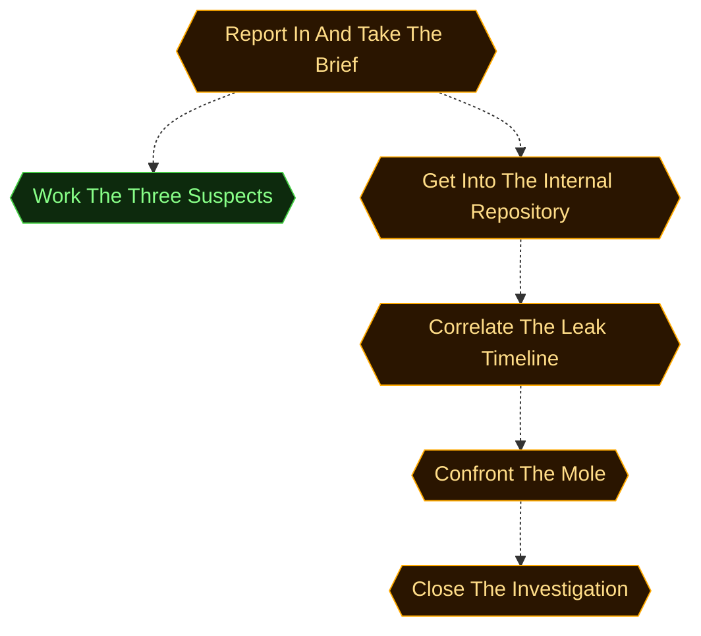
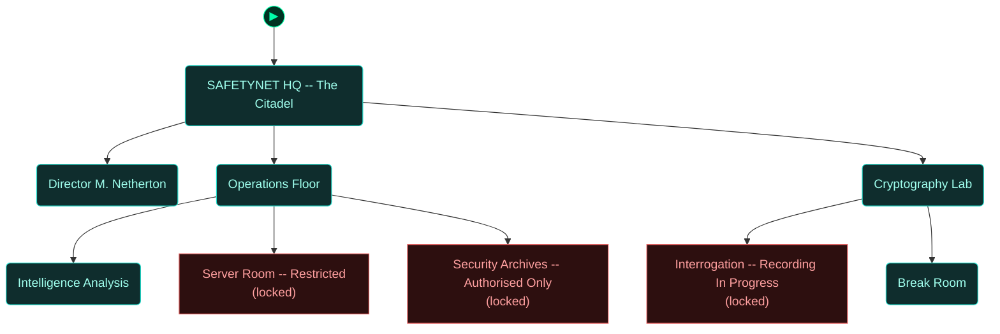

<!-- Auto-generated by scripts/generate_dungeon_graph.rb — do not edit by hand -->

# m08_the_mole — Scenario Graph Reference

Nine days ago four ENTROPY operations went live inside the same minute, and the ones nobody could reach cost lives. Since that night you have known why. An intercept pulled off the wire was timestamped before the deployment order was ever written -- which means ENTROPY did not guess where SAFETYNET would send you. Somebody told them. The leak was not the operation. The leak was the agent. Director Netherton has pulled you back to the Citadel, SAFETYNET's own headquarters, and handed you three names. One of them has been feeding the people who got your colleagues killed. Find the mole. Do it quietly -- the moment they know you are looking, they are gone.

## Scenario Statistics

| Metric | Value |
|---|---|
| Story aims | 6 |
| Total tasks | 15 (2 optional) |
| VM flag challenges | 4 |
| Physical locks | 6 |
| AND-gate convergences | 0 |
| Rooms | 9 |
| Puzzle graph nodes / edges | 50 / 62 |
| Story graph nodes / edges | 6 / 5 |

## Critical Path

4 hops through story aims — minimum mandatory sequence to reach mission completion:

**Report In And Take The Brief → Get Into The Internal Repository → Correlate The Leak Timeline → Confront The Mole → Close The Investigation**

## How to Read These Diagrams

| Shape | Colour | Meaning |
|---|---|---|
| Rounded rectangle | Teal | Room / physical area |
| Rectangle | Red | Lock, barrier, or interactive terminal |
| Diamond | Orange | Inventory item or credential |
| Diamond | Red/Pink | NPC or physical key |
| Diamond | Purple | VM flag (challenge completion token) |
| Rectangle | Blue | VM challenge |
| Ribbon | Amber | NPC conversation / action gate |
| Hexagon | Green | Story aim (objective) |
| Hexagon | Amber | Critical path node |
| Circle | Grey | AND gate (all inputs required) |
| Subroutine rect `[[…]]` | Green | Container (holds items) |
| Rounded rectangle | Amber | NPC in room (Rooms & Contents only) |

Edges: `-->` solid = hard dependency; `-.->` dashed = soft / narrative dependency or optional path.

The `▶` node marks the player's starting room.

## Puzzle Graph

Physical lock–key dependency chain. Shows which items, codes, and NPC interactions are required to open each lock, and which locks gate access to each room or object. Use this to trace solvability, spot circular dependencies, and check that every key is reachable before the lock that needs it.

```mermaid
flowchart TD

  classDef room      fill:#0f2d2d,stroke:#22ddcc,color:#a0ffee
  classDef lock      fill:#2d0f0f,stroke:#e66060,color:#ffa0a0
  classDef key       fill:#2d0812,stroke:#e66060,color:#ffa0a0
  classDef item      fill:#2d1200,stroke:#e89030,color:#ffcc80
  classDef gate      fill:#111,stroke:#666,color:#eee
  classDef vm        fill:#0c1f40,stroke:#4a90d9,color:#a0c8ff
  classDef flag      fill:#1a0c2d,stroke:#9060d0,color:#cc99ff
  classDef action    fill:#1a1200,stroke:#cc9922,color:#ffee88
  classDef aim       fill:#0d2a0d,stroke:#44cc44,color:#88ff88
  classDef aim_gate  fill:#111111,stroke:#44cc44,color:#44cc44
  classDef container fill:#1a2d1a,stroke:#60b060,color:#a0e0a0
  classDef npc       fill:#2d1f0d,stroke:#d0a050,color:#ffe0a0
  classDef critical  fill:#2a1500,stroke:#ffaa00,color:#ffdd88
  classDef start     fill:#003322,stroke:#00ffaa,color:#00ffaa

  node_start(("▶"))
  node_start --> main_lobby

  door_server_room["Server Room -- Restricted<br/>RFID lock"]
  server_room("Server Room -- Restricted")
  door_security_archives["Security Archives -- Authorised Only<br/>Password lock"]
  security_archives("Security Archives -- Authorised Only")
  door_interrogation_room["Interrogation -- Recording In Progress<br/>PIN lock"]
  interrogation_room("Interrogation -- Recording In Progress")
  main_lobby("SAFETYNET HQ -- The Citadel")
  lock_pick_kit{"Lock Pick Kit"}
  lock_nightshade_locker["Nightshade Locker"]
  rfid_cloner{"RFID Cloner"}
  fingerprint_kit{"Fingerprint Kit"}
  lock_badge_printer["Visitor Badge Printer<br/>PIN lock"]
  printed_server_zone_badge{"Printed Server-Zone Badge"}
  director_office("Director M. Netherton")
  lock_director_safe["Director's Safe<br/>PIN lock"]
  interrogation_suite_code_card{"Interrogation Suite Code Card"}
  sealed_psych_evaluation_agent_0x47{"Sealed Psych Evaluation -- Agent 0x47"}
  director_s_safe{"Director's Safe"}
  npc_director_magnus_netherton{"Director Magnus Netherton"}
  director_s_access_keycard_all_zones{"Director's Access Keycard -- All Zones"}
  action_clone_the_director_card>"Clone the Director's card (after the three interviews)"]
  action_read_the_door_audit_to_the_director>"Read the door audit to the Director (suite code aloud)"]
  operations_floor("Operations Floor")
  personnel_print_job_director_s_investigation_request{"Personnel Print Job -- Director's Investigation Request"}
  intel_analysis("Intelligence Analysis")
  four_site_night_tactical_board{"Four-Site Night Tactical Board"}
  phantom_s_off_book_notes{"Phantom's Off-Book Notes"}
  gitlist_repository_server["GitList Repository Server"]
  server_access_log_excerpt{"Server Access Log (excerpt)"}
  global_threat_database_catalogue{"Global Threat Database Catalogue"}
  badge_audit_printout_leak_window{"Badge Audit Printout -- Leak Window"}
  npc_agent_0x47_nightshade{"Agent 0x47 'Nightshade'"}
  cryptography_lab("Cryptography Lab")
  nightshade_s_locker_key{"Nightshade's Locker Key"}
  detention_disposition_screen{"Detention Disposition Screen"}
  break_room("Break Room")
  post_it_on_the_coffee_machine{"Post-It On The Coffee Machine"}
  leak_timeline_someone_s_working_notes{"Leak Timeline (someone's working notes)"}
  usb_stick_personal_backup_enc{"USB Stick -- PERSONAL_BACKUP.enc"}
  insider_threat_initiative_deep_state_brief{"Insider Threat Initiative -- 'Deep State' Brief"}
  go_bag_locker_0x47{"Go-Bag -- Locker 0x47"}
  staff_locker_0x47{"Staff Locker -- 0x47"}
  vmch_recover_gitlist_exposure["Exploit the repository browser and submit the first flag"]
  vmfl_recover_gitlist_exposure{"Recover Gitlist Exposure Flag"}
  vmch_recover_stashed_credentials["Recover the stashed credentials and submit the second flag"]
  vmfl_recover_stashed_credentials{"Recover Stashed Credentials Flag"}
  vmch_recover_home_flag["Log in properly and submit the home-directory flag"]
  vmfl_recover_home_flag{"Recover Home Flag"}
  vmch_escalate_to_root["Escalate to root and submit the final flag"]
  vmfl_escalate_to_root{"Escalate To Root Flag"}

  door_server_room --> server_room
  door_security_archives --> security_archives
  door_interrogation_room --> interrogation_room
  main_lobby -.-> lock_pick_kit
  lock_pick_kit -.-> lock_nightshade_locker
  main_lobby --> rfid_cloner
  main_lobby --> fingerprint_kit
  main_lobby --> lock_badge_printer
  lock_badge_printer -.-> printed_server_zone_badge
  printed_server_zone_badge -.-> door_server_room
  director_office --> lock_director_safe
  lock_director_safe --> interrogation_suite_code_card
  interrogation_suite_code_card --> door_interrogation_room
  lock_director_safe --> sealed_psych_evaluation_agent_0x47
  director_office -.-> director_s_safe
  director_s_safe -.-> door_interrogation_room
  director_office --> npc_director_magnus_netherton
  npc_director_magnus_netherton -.-> director_s_access_keycard_all_zones
  director_s_access_keycard_all_zones -.-> door_server_room
  npc_director_magnus_netherton --> action_clone_the_director_card
  npc_director_magnus_netherton --> action_read_the_door_audit_to_the_director
  operations_floor --> personnel_print_job_director_s_investigation_request
  personnel_print_job_director_s_investigation_request --> lock_director_safe
  intel_analysis --> four_site_night_tactical_board
  intel_analysis --> phantom_s_off_book_notes
  server_room --> gitlist_repository_server
  server_room --> server_access_log_excerpt
  security_archives --> global_threat_database_catalogue
  security_archives --> badge_audit_printout_leak_window
  cryptography_lab --> npc_agent_0x47_nightshade
  npc_agent_0x47_nightshade --> nightshade_s_locker_key
  nightshade_s_locker_key --> lock_nightshade_locker
  interrogation_room --> detention_disposition_screen
  break_room --> post_it_on_the_coffee_machine
  post_it_on_the_coffee_machine --> door_security_archives
  post_it_on_the_coffee_machine --> lock_badge_printer
  break_room --> leak_timeline_someone_s_working_notes
  break_room --> lock_nightshade_locker
  lock_nightshade_locker --> usb_stick_personal_backup_enc
  lock_nightshade_locker --> insider_threat_initiative_deep_state_brief
  lock_nightshade_locker --> go_bag_locker_0x47
  break_room --> staff_locker_0x47
  vmch_recover_gitlist_exposure --> vmfl_recover_gitlist_exposure
  vmch_recover_stashed_credentials --> vmfl_recover_stashed_credentials
  vmfl_recover_gitlist_exposure -.-> vmch_recover_stashed_credentials
  vmch_recover_home_flag --> vmfl_recover_home_flag
  vmfl_recover_stashed_credentials -.-> vmch_recover_home_flag
  vmch_escalate_to_root --> vmfl_escalate_to_root
  vmfl_recover_home_flag -.-> vmch_escalate_to_root
  gitlist_repository_server --> vmch_recover_gitlist_exposure
  main_lobby --> director_office
  main_lobby --> operations_floor
  main_lobby --> cryptography_lab
  operations_floor --> intel_analysis
  cryptography_lab --> break_room
  rfid_cloner --> action_clone_the_director_card
  action_clone_the_director_card --> door_server_room
  fingerprint_kit -.-> usb_stick_personal_backup_enc
  server_access_log_excerpt -.-> action_read_the_door_audit_to_the_director
  badge_audit_printout_leak_window -.-> action_read_the_door_audit_to_the_director
  action_read_the_door_audit_to_the_director -.-> door_interrogation_room
  leak_timeline_someone_s_working_notes -.-> action_read_the_door_audit_to_the_director

  class door_server_room,door_security_archives,door_interrogation_room,lock_nightshade_locker,lock_badge_printer,lock_director_safe lock
  class server_room,security_archives,interrogation_room,main_lobby,director_office,operations_floor,intel_analysis,cryptography_lab,break_room room
  class lock_pick_kit,rfid_cloner,fingerprint_kit,sealed_psych_evaluation_agent_0x47,director_s_safe,personnel_print_job_director_s_investigation_request,four_site_night_tactical_board,phantom_s_off_book_notes,server_access_log_excerpt,global_threat_database_catalogue,badge_audit_printout_leak_window,detention_disposition_screen,post_it_on_the_coffee_machine,leak_timeline_someone_s_working_notes,usb_stick_personal_backup_enc,insider_threat_initiative_deep_state_brief,go_bag_locker_0x47,staff_locker_0x47 item
  class printed_server_zone_badge,interrogation_suite_code_card,npc_director_magnus_netherton,director_s_access_keycard_all_zones,npc_agent_0x47_nightshade,nightshade_s_locker_key key
  class action_clone_the_director_card,action_read_the_door_audit_to_the_director action
  class gitlist_repository_server,vmch_recover_gitlist_exposure,vmch_recover_stashed_credentials,vmch_recover_home_flag,vmch_escalate_to_root vm
  class vmfl_recover_gitlist_exposure,vmfl_recover_stashed_credentials,vmfl_recover_home_flag,vmfl_escalate_to_root flag

  classDef optional stroke-dasharray:5 2
  class lock_pick_kit,printed_server_zone_badge,director_s_safe,director_s_access_keycard_all_zones optional
  class node_start start
```

## Story Aims

Narrative objective flow. Shows story aims and their unlock conditions. Critical path aims are highlighted in amber. Use this to check aim sequencing, identify gaps between objectives, and verify that the player always has a clear next goal.

## Story + Puzzle (Integrated)

Puzzle graph and story aims combined, with bridge edges connecting physical puzzle progress to story aim completion. Use this to verify that physical actions drive narrative progress and that no aim is left floating without a puzzle prerequisite.

```mermaid
flowchart TD

  classDef room      fill:#0f2d2d,stroke:#22ddcc,color:#a0ffee
  classDef lock      fill:#2d0f0f,stroke:#e66060,color:#ffa0a0
  classDef key       fill:#2d0812,stroke:#e66060,color:#ffa0a0
  classDef item      fill:#2d1200,stroke:#e89030,color:#ffcc80
  classDef gate      fill:#111,stroke:#666,color:#eee
  classDef vm        fill:#0c1f40,stroke:#4a90d9,color:#a0c8ff
  classDef flag      fill:#1a0c2d,stroke:#9060d0,color:#cc99ff
  classDef action    fill:#1a1200,stroke:#cc9922,color:#ffee88
  classDef aim       fill:#0d2a0d,stroke:#44cc44,color:#88ff88
  classDef aim_gate  fill:#111111,stroke:#44cc44,color:#44cc44
  classDef container fill:#1a2d1a,stroke:#60b060,color:#a0e0a0
  classDef npc       fill:#2d1f0d,stroke:#d0a050,color:#ffe0a0
  classDef critical  fill:#2a1500,stroke:#ffaa00,color:#ffdd88
  classDef start     fill:#003322,stroke:#00ffaa,color:#00ffaa

  node_start(("▶"))
  node_start --> main_lobby

  door_server_room["Server Room -- Restricted<br/>RFID lock"]
  server_room("Server Room -- Restricted")
  door_security_archives["Security Archives -- Authorised Only<br/>Password lock"]
  security_archives("Security Archives -- Authorised Only")
  door_interrogation_room["Interrogation -- Recording In Progress<br/>PIN lock"]
  interrogation_room("Interrogation -- Recording In Progress")
  main_lobby("SAFETYNET HQ -- The Citadel")
  lock_pick_kit{"Lock Pick Kit"}
  lock_nightshade_locker["Nightshade Locker"]
  rfid_cloner{"RFID Cloner"}
  fingerprint_kit{"Fingerprint Kit"}
  lock_badge_printer["Visitor Badge Printer<br/>PIN lock"]
  printed_server_zone_badge{"Printed Server-Zone Badge"}
  director_office("Director M. Netherton")
  lock_director_safe["Director's Safe<br/>PIN lock"]
  interrogation_suite_code_card{"Interrogation Suite Code Card"}
  sealed_psych_evaluation_agent_0x47{"Sealed Psych Evaluation -- Agent 0x47"}
  director_s_safe{"Director's Safe"}
  npc_director_magnus_netherton{"Director Magnus Netherton"}
  director_s_access_keycard_all_zones{"Director's Access Keycard -- All Zones"}
  action_clone_the_director_card>"Clone the Director's card (after the three interviews)"]
  action_read_the_door_audit_to_the_director>"Read the door audit to the Director (suite code aloud)"]
  operations_floor("Operations Floor")
  personnel_print_job_director_s_investigation_request{"Personnel Print Job -- Director's Investigation Request"}
  intel_analysis("Intelligence Analysis")
  four_site_night_tactical_board{"Four-Site Night Tactical Board"}
  phantom_s_off_book_notes{"Phantom's Off-Book Notes"}
  gitlist_repository_server["GitList Repository Server"]
  server_access_log_excerpt{"Server Access Log (excerpt)"}
  global_threat_database_catalogue{"Global Threat Database Catalogue"}
  badge_audit_printout_leak_window{"Badge Audit Printout -- Leak Window"}
  npc_agent_0x47_nightshade{"Agent 0x47 'Nightshade'"}
  cryptography_lab("Cryptography Lab")
  nightshade_s_locker_key{"Nightshade's Locker Key"}
  detention_disposition_screen{"Detention Disposition Screen"}
  break_room("Break Room")
  post_it_on_the_coffee_machine{"Post-It On The Coffee Machine"}
  leak_timeline_someone_s_working_notes{"Leak Timeline (someone's working notes)"}
  usb_stick_personal_backup_enc{"USB Stick -- PERSONAL_BACKUP.enc"}
  insider_threat_initiative_deep_state_brief{"Insider Threat Initiative -- 'Deep State' Brief"}
  go_bag_locker_0x47{"Go-Bag -- Locker 0x47"}
  staff_locker_0x47{"Staff Locker -- 0x47"}
  vmch_recover_gitlist_exposure["Exploit the repository browser and submit the first flag"]
  vmfl_recover_gitlist_exposure{"Recover Gitlist Exposure Flag"}
  vmch_recover_stashed_credentials["Recover the stashed credentials and submit the second flag"]
  vmfl_recover_stashed_credentials{"Recover Stashed Credentials Flag"}
  vmch_recover_home_flag["Log in properly and submit the home-directory flag"]
  vmfl_recover_home_flag{"Recover Home Flag"}
  vmch_escalate_to_root["Escalate to root and submit the final flag"]
  vmfl_escalate_to_root{"Escalate To Root Flag"}
  aim_take_the_brief{{"Report In And Take The Brief"}}
  aim_work_the_suspects{{"Work The Three Suspects"}}
  aim_get_into_the_repo{{"Get Into The Internal Repository"}}
  aim_correlate_the_evidence{{"Correlate The Leak Timeline"}}
  aim_confront_the_mole{{"Confront The Mole"}}
  aim_close_the_investigation{{"Close The Investigation"}}

  door_server_room --> server_room
  door_security_archives --> security_archives
  door_interrogation_room --> interrogation_room
  main_lobby -.-> lock_pick_kit
  lock_pick_kit -.-> lock_nightshade_locker
  main_lobby --> rfid_cloner
  main_lobby --> fingerprint_kit
  main_lobby --> lock_badge_printer
  lock_badge_printer -.-> printed_server_zone_badge
  printed_server_zone_badge -.-> door_server_room
  director_office --> lock_director_safe
  lock_director_safe --> interrogation_suite_code_card
  interrogation_suite_code_card --> door_interrogation_room
  lock_director_safe --> sealed_psych_evaluation_agent_0x47
  director_office -.-> director_s_safe
  director_s_safe -.-> door_interrogation_room
  director_office --> npc_director_magnus_netherton
  npc_director_magnus_netherton -.-> director_s_access_keycard_all_zones
  director_s_access_keycard_all_zones -.-> door_server_room
  npc_director_magnus_netherton --> action_clone_the_director_card
  npc_director_magnus_netherton --> action_read_the_door_audit_to_the_director
  operations_floor --> personnel_print_job_director_s_investigation_request
  personnel_print_job_director_s_investigation_request --> lock_director_safe
  intel_analysis --> four_site_night_tactical_board
  intel_analysis --> phantom_s_off_book_notes
  server_room --> gitlist_repository_server
  server_room --> server_access_log_excerpt
  security_archives --> global_threat_database_catalogue
  security_archives --> badge_audit_printout_leak_window
  cryptography_lab --> npc_agent_0x47_nightshade
  npc_agent_0x47_nightshade --> nightshade_s_locker_key
  nightshade_s_locker_key --> lock_nightshade_locker
  interrogation_room --> detention_disposition_screen
  break_room --> post_it_on_the_coffee_machine
  post_it_on_the_coffee_machine --> door_security_archives
  post_it_on_the_coffee_machine --> lock_badge_printer
  break_room --> leak_timeline_someone_s_working_notes
  break_room --> lock_nightshade_locker
  lock_nightshade_locker --> usb_stick_personal_backup_enc
  lock_nightshade_locker --> insider_threat_initiative_deep_state_brief
  lock_nightshade_locker --> go_bag_locker_0x47
  break_room --> staff_locker_0x47
  vmch_recover_gitlist_exposure --> vmfl_recover_gitlist_exposure
  vmch_recover_stashed_credentials --> vmfl_recover_stashed_credentials
  vmfl_recover_gitlist_exposure -.-> vmch_recover_stashed_credentials
  vmch_recover_home_flag --> vmfl_recover_home_flag
  vmfl_recover_stashed_credentials -.-> vmch_recover_home_flag
  vmch_escalate_to_root --> vmfl_escalate_to_root
  vmfl_recover_home_flag -.-> vmch_escalate_to_root
  gitlist_repository_server --> vmch_recover_gitlist_exposure
  main_lobby --> director_office
  main_lobby --> operations_floor
  main_lobby --> cryptography_lab
  operations_floor --> intel_analysis
  cryptography_lab --> break_room
  rfid_cloner --> action_clone_the_director_card
  action_clone_the_director_card --> door_server_room
  fingerprint_kit -.-> usb_stick_personal_backup_enc
  server_access_log_excerpt -.-> action_read_the_door_audit_to_the_director
  badge_audit_printout_leak_window -.-> action_read_the_door_audit_to_the_director
  action_read_the_door_audit_to_the_director -.-> door_interrogation_room
  leak_timeline_someone_s_working_notes -.-> action_read_the_door_audit_to_the_director
  aim_take_the_brief -.-> aim_work_the_suspects
  aim_take_the_brief -.-> aim_get_into_the_repo
  aim_get_into_the_repo -.-> aim_correlate_the_evidence
  aim_correlate_the_evidence -.-> aim_confront_the_mole
  aim_confront_the_mole -.-> aim_close_the_investigation
  vmfl_recover_gitlist_exposure -.-> aim_get_into_the_repo
  vmfl_recover_stashed_credentials -.-> aim_get_into_the_repo
  vmfl_recover_home_flag -.-> aim_correlate_the_evidence
  vmfl_escalate_to_root -.-> aim_correlate_the_evidence

  class door_server_room,door_security_archives,door_interrogation_room,lock_nightshade_locker,lock_badge_printer,lock_director_safe lock
  class server_room,security_archives,interrogation_room,main_lobby,director_office,operations_floor,intel_analysis,cryptography_lab,break_room room
  class lock_pick_kit,rfid_cloner,fingerprint_kit,sealed_psych_evaluation_agent_0x47,director_s_safe,personnel_print_job_director_s_investigation_request,four_site_night_tactical_board,phantom_s_off_book_notes,server_access_log_excerpt,global_threat_database_catalogue,badge_audit_printout_leak_window,detention_disposition_screen,post_it_on_the_coffee_machine,leak_timeline_someone_s_working_notes,usb_stick_personal_backup_enc,insider_threat_initiative_deep_state_brief,go_bag_locker_0x47,staff_locker_0x47 item
  class printed_server_zone_badge,interrogation_suite_code_card,npc_director_magnus_netherton,director_s_access_keycard_all_zones,npc_agent_0x47_nightshade,nightshade_s_locker_key key
  class action_clone_the_director_card,action_read_the_door_audit_to_the_director action
  class gitlist_repository_server,vmch_recover_gitlist_exposure,vmch_recover_stashed_credentials,vmch_recover_home_flag,vmch_escalate_to_root vm
  class vmfl_recover_gitlist_exposure,vmfl_recover_stashed_credentials,vmfl_recover_home_flag,vmfl_escalate_to_root flag
  class aim_take_the_brief,aim_get_into_the_repo,aim_correlate_the_evidence,aim_confront_the_mole,aim_close_the_investigation critical
  class aim_work_the_suspects aim

  classDef optional stroke-dasharray:5 2
  class lock_pick_kit,printed_server_zone_badge,director_s_safe,director_s_access_keycard_all_zones optional
  class node_start start
```

## Rooms

Physical room layout with all connections. Locked rooms are shown in red. Use this to check room reachability, identify dead-end rooms with no content, and understand the spatial structure of the scenario.

## Rooms & Contents

Physical room layout with all objects, containers, NPCs, and held items. Use this to check clue distribution across rooms, verify that hints are placed before the locks they solve, and spot rooms that are under- or over-loaded with content.

```mermaid
flowchart TD

  classDef room      fill:#0f2d2d,stroke:#22ddcc,color:#a0ffee
  classDef lock      fill:#2d0f0f,stroke:#e66060,color:#ffa0a0
  classDef key       fill:#2d0812,stroke:#e66060,color:#ffa0a0
  classDef item      fill:#2d1200,stroke:#e89030,color:#ffcc80
  classDef gate      fill:#111,stroke:#666,color:#eee
  classDef vm        fill:#0c1f40,stroke:#4a90d9,color:#a0c8ff
  classDef flag      fill:#1a0c2d,stroke:#9060d0,color:#cc99ff
  classDef action    fill:#1a1200,stroke:#cc9922,color:#ffee88
  classDef aim       fill:#0d2a0d,stroke:#44cc44,color:#88ff88
  classDef aim_gate  fill:#111111,stroke:#44cc44,color:#44cc44
  classDef container fill:#1a2d1a,stroke:#60b060,color:#a0e0a0
  classDef npc       fill:#2d1f0d,stroke:#d0a050,color:#ffe0a0
  classDef critical  fill:#2a1500,stroke:#ffaa00,color:#ffdd88
  classDef start     fill:#003322,stroke:#00ffaa,color:#00ffaa

  node_start(("▶"))
  node_start --> main_lobby

  main_lobby("SAFETYNET HQ -- The Citadel")
  director_office("Director M. Netherton")
  operations_floor("Operations Floor")
  intel_analysis("Intelligence Analysis")
  server_room["Server Room -- Restricted<br/>(locked)"]
  security_archives["Security Archives -- Authorised Only<br/>(locked)"]
  cryptography_lab("Cryptography Lab")
  interrogation_room["Interrogation -- Recording In Progress<br/>(locked)"]
  break_room("Break Room")
  rc_badge_printer_1[["Visitor Badge Printer"]]
  rc_printed_server_badge_2{"Printed Server-Zone Badge"}
  rc_security_notice_3{"Security Alert Board"}
  rc_npc_athena_4("ATHENA")
  rc_npc_athena_5("ATHENA")
  rc_npc_agent_hax_6("Agent HaX")
  rc_m08_recon_field_guide_7{"SAFETYNET Field Guide: Reconnaissance and Network Mapping"}
  rc_m08_scanning_field_guide_8{"SAFETYNET Field Guide: Scanning and Exploitation"}
  rc_m08_gitsecrets_field_guide_9{"SAFETYNET Field Guide: Secrets in Git History"}
  rc_m08_cyberchef_field_guide_10{"SAFETYNET Field Guide: Encoding and Decoding with CyberChef"}
  rc_m08_vulnanalysis_field_guide_11{"SAFETYNET Field Guide: Vulnerability Analysis"}
  rc_m08_privesc_field_guide_12{"SAFETYNET Field Guide: Privilege Escalation"}
  rc_npc_director_magnus_netherton_13("Director Magnus Netherton")
  rc_suspect_dossiers_14{"Suspect Dossiers"}
  rc_director_safe_15[["Director's Safe"]]
  rc_interrogation_suite_code_16{"Interrogation Suite Code Card"}
  rc_nightshade_profile_17{"Sealed Psych Evaluation -- Agent 0x47"}
  rc_npc_director_magnus_netherton_18("Director Magnus Netherton")
  rc_netherton_keycard_19{"Director's Access Keycard -- All Zones"}
  rc_nightshade_personnel_record_20{"Personnel Print Job -- Director's Investigation Request"}
  rc_operations_board_21{"Operations Status Board"}
  rc_npc_agent_0x23_cipher_22("Agent 0x23 'Cipher'")
  rc_npc_junior_analyst_23("Junior Analyst")
  rc_tactical_board_24{"Four-Site Night Tactical Board"}
  rc_phantom_notes_25{"Phantom's Off-Book Notes"}
  rc_npc_agent_0x88_phantom_26("Agent 0x88 'Phantom'")
  rc_vm_launcher_gitlist_27{"GitList Repository Server"}
  rc_flag_station_evidence_relay_28{"Evidence Relay Terminal"}
  rc_server_access_logs_29{"Server Access Log (excerpt)"}
  rc_database_catalog_30{"Global Threat Database Catalogue"}
  rc_historical_leaks_31{"Past Leak Investigations"}
  rc_badge_audit_printout_32{"Badge Audit Printout -- Leak Window"}
  rc_cyberchef_workstation_33{"CyberChef Workstation"}
  rc_nightshade_desk_34{"Nightshade's Workstation"}
  rc_npc_agent_0x47_nightshade_35("Agent 0x47 'Nightshade'")
  rc_nightshade_locker_key_36{"Nightshade's Locker Key"}
  rc_evidence_display_37{"Evidence Display"}
  rc_disposition_terminal_38{"Detention Disposition Screen"}
  rc_npc_agent_0x47_nightshade_39("Agent 0x47 'Nightshade'")
  rc_password_sticky_note_40{"Post-It On The Coffee Machine"}
  rc_timeline_reconstruction_41{"Leak Timeline (someone's working notes)"}
  rc_nightshade_locker_42[["Staff Locker -- 0x47"]]
  rc_encrypted_backup_43{"USB Stick -- PERSONAL_BACKUP.enc"}
  rc_deep_state_manual_44{"Insider Threat Initiative -- 'Deep State' Brief"}
  rc_nightshade_go_bag_45{"Go-Bag -- Locker 0x47"}
  rc_npc_agent_hax_46("Agent HaX")
  rc_npc_off_duty_agent_47("Off-Duty Agent")

  main_lobby --> director_office
  main_lobby --> operations_floor
  main_lobby --> cryptography_lab
  operations_floor --> intel_analysis
  operations_floor --> server_room
  operations_floor --> security_archives
  cryptography_lab --> interrogation_room
  cryptography_lab --> break_room
  main_lobby --> rc_badge_printer_1
  rc_badge_printer_1 --> rc_printed_server_badge_2
  main_lobby --> rc_security_notice_3
  main_lobby --> rc_npc_athena_4
  main_lobby --> rc_npc_athena_5
  main_lobby --> rc_npc_agent_hax_6
  rc_npc_agent_hax_6 --> rc_m08_recon_field_guide_7
  rc_npc_agent_hax_6 --> rc_m08_scanning_field_guide_8
  rc_npc_agent_hax_6 --> rc_m08_gitsecrets_field_guide_9
  rc_npc_agent_hax_6 --> rc_m08_cyberchef_field_guide_10
  rc_npc_agent_hax_6 --> rc_m08_vulnanalysis_field_guide_11
  rc_npc_agent_hax_6 --> rc_m08_privesc_field_guide_12
  main_lobby --> rc_npc_director_magnus_netherton_13
  director_office --> rc_suspect_dossiers_14
  director_office --> rc_director_safe_15
  rc_director_safe_15 --> rc_interrogation_suite_code_16
  rc_director_safe_15 --> rc_nightshade_profile_17
  director_office --> rc_npc_director_magnus_netherton_18
  rc_npc_director_magnus_netherton_18 --> rc_netherton_keycard_19
  operations_floor --> rc_nightshade_personnel_record_20
  operations_floor --> rc_operations_board_21
  operations_floor --> rc_npc_agent_0x23_cipher_22
  operations_floor --> rc_npc_junior_analyst_23
  intel_analysis --> rc_tactical_board_24
  intel_analysis --> rc_phantom_notes_25
  intel_analysis --> rc_npc_agent_0x88_phantom_26
  server_room --> rc_vm_launcher_gitlist_27
  server_room --> rc_flag_station_evidence_relay_28
  server_room --> rc_server_access_logs_29
  security_archives --> rc_database_catalog_30
  security_archives --> rc_historical_leaks_31
  security_archives --> rc_badge_audit_printout_32
  cryptography_lab --> rc_cyberchef_workstation_33
  cryptography_lab --> rc_nightshade_desk_34
  cryptography_lab --> rc_npc_agent_0x47_nightshade_35
  rc_npc_agent_0x47_nightshade_35 --> rc_nightshade_locker_key_36
  interrogation_room --> rc_evidence_display_37
  interrogation_room --> rc_disposition_terminal_38
  interrogation_room --> rc_npc_agent_0x47_nightshade_39
  break_room --> rc_password_sticky_note_40
  break_room --> rc_timeline_reconstruction_41
  break_room --> rc_nightshade_locker_42
  rc_nightshade_locker_42 --> rc_encrypted_backup_43
  rc_nightshade_locker_42 --> rc_deep_state_manual_44
  rc_nightshade_locker_42 --> rc_nightshade_go_bag_45
  break_room --> rc_npc_agent_hax_46
  break_room --> rc_npc_off_duty_agent_47

  class main_lobby,director_office,operations_floor,intel_analysis,cryptography_lab,break_room room
  class server_room,security_archives,interrogation_room lock
  class rc_badge_printer_1,rc_director_safe_15,rc_nightshade_locker_42 container
  class rc_printed_server_badge_2,rc_security_notice_3,rc_m08_recon_field_guide_7,rc_m08_scanning_field_guide_8,rc_m08_gitsecrets_field_guide_9,rc_m08_cyberchef_field_guide_10,rc_m08_vulnanalysis_field_guide_11,rc_m08_privesc_field_guide_12,rc_suspect_dossiers_14,rc_interrogation_suite_code_16,rc_nightshade_profile_17,rc_netherton_keycard_19,rc_nightshade_personnel_record_20,rc_operations_board_21,rc_tactical_board_24,rc_phantom_notes_25,rc_vm_launcher_gitlist_27,rc_flag_station_evidence_relay_28,rc_server_access_logs_29,rc_database_catalog_30,rc_historical_leaks_31,rc_badge_audit_printout_32,rc_cyberchef_workstation_33,rc_nightshade_desk_34,rc_nightshade_locker_key_36,rc_evidence_display_37,rc_disposition_terminal_38,rc_password_sticky_note_40,rc_timeline_reconstruction_41,rc_encrypted_backup_43,rc_deep_state_manual_44,rc_nightshade_go_bag_45 item
  class rc_npc_athena_4,rc_npc_athena_5,rc_npc_agent_hax_6,rc_npc_director_magnus_netherton_13,rc_npc_director_magnus_netherton_18,rc_npc_agent_0x23_cipher_22,rc_npc_junior_analyst_23,rc_npc_agent_0x88_phantom_26,rc_npc_agent_0x47_nightshade_35,rc_npc_agent_0x47_nightshade_39,rc_npc_agent_hax_46,rc_npc_off_duty_agent_47 npc
  class node_start start
```

