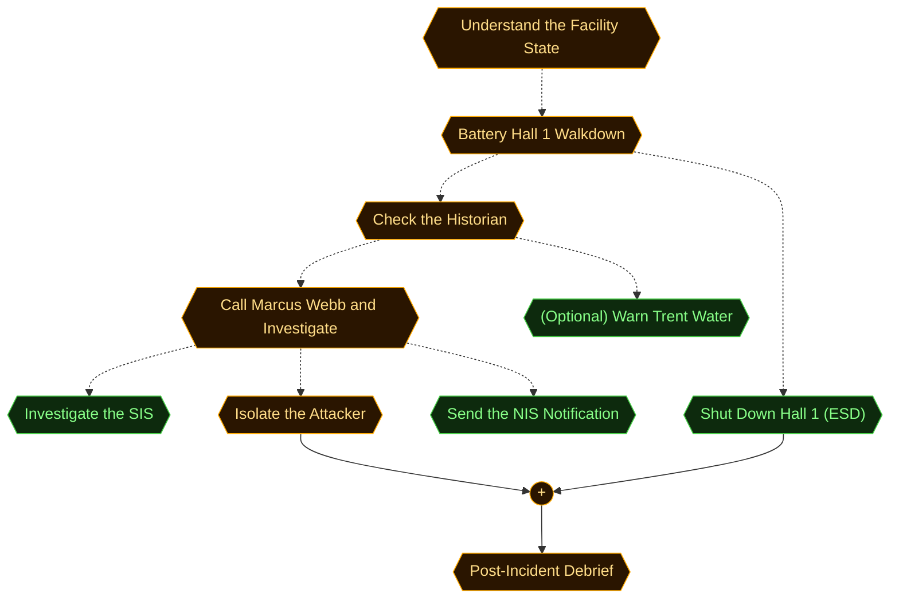
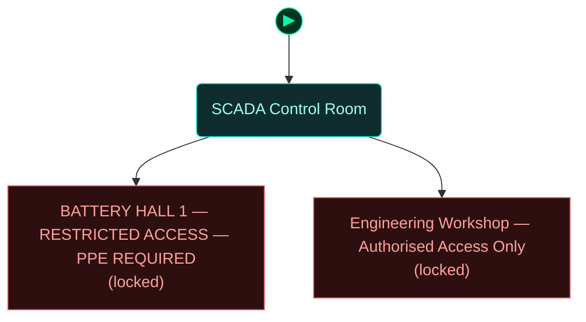

<!-- Auto-generated by scripts/generate_dungeon_graph.rb — do not edit by hand -->

# sis02_energy — Scenario Graph Reference

Saturday 21 March 2026, 06:30. Albion Energy Storage, on the Trent near Newark: 100 MW and 200 MWh of lithium-ion batteries, designated an operator of essential services. You are the response and engineering team booked for the 07:00 maintenance window on the grid interface PLC. Helen Marsh, the site's SCADA engineer, got in at 06:15. Every screen in the control room says the night was normal. Helen isn't so sure, and she wants a word before anyone touches anything.

## Scenario Statistics

| Metric | Value |
|---|---|
| Story aims | 10 |
| Total tasks | 19 (1 optional) |
| VM flag challenges | 0 |
| Physical locks | 4 |
| AND-gate convergences | 1 |
| Rooms | 3 |
| Puzzle graph nodes / edges | 36 / 38 |
| Story graph nodes / edges | 11 / 11 |

## Critical Path

6 hops through story aims — minimum mandatory sequence to reach mission completion:

**Understand the Facility State → Battery Hall 1 Walkdown → Check the Historian → Call Marcus Webb and Investigate → Isolate the Attacker → + → Post-Incident Debrief**

## How to Read These Diagrams

| Shape | Colour | Meaning |
|---|---|---|
| Rounded rectangle | Teal | Room / physical area |
| Rectangle | Red | Lock, barrier, or interactive terminal |
| Diamond | Orange | Inventory item or credential |
| Diamond | Red/Pink | NPC or physical key |
| Diamond | Purple | VM flag (challenge completion token) |
| Rectangle | Blue | VM challenge |
| Ribbon | Amber | NPC conversation / action gate |
| Hexagon | Green | Story aim (objective) |
| Hexagon | Amber | Critical path node |
| Circle | Grey | AND gate (all inputs required) |
| Subroutine rect `[[…]]` | Green | Container (holds items) |
| Rounded rectangle | Amber | NPC in room (Rooms & Contents only) |

Edges: `-->` solid = hard dependency; `-.->` dashed = soft / narrative dependency or optional path.

The `▶` node marks the player's starting room.

## Puzzle Graph

Physical lock–key dependency chain. Shows which items, codes, and NPC interactions are required to open each lock, and which locks gate access to each room or object. Use this to trace solvability, spot circular dependencies, and check that every key is reachable before the lock that needs it.

```mermaid
flowchart TD

  classDef room      fill:#0f2d2d,stroke:#22ddcc,color:#a0ffee
  classDef lock      fill:#2d0f0f,stroke:#e66060,color:#ffa0a0
  classDef key       fill:#2d0812,stroke:#e66060,color:#ffa0a0
  classDef item      fill:#2d1200,stroke:#e89030,color:#ffcc80
  classDef gate      fill:#111,stroke:#666,color:#eee
  classDef vm        fill:#0c1f40,stroke:#4a90d9,color:#a0c8ff
  classDef flag      fill:#1a0c2d,stroke:#9060d0,color:#cc99ff
  classDef action    fill:#1a1200,stroke:#cc9922,color:#ffee88
  classDef aim       fill:#0d2a0d,stroke:#44cc44,color:#88ff88
  classDef aim_gate  fill:#111111,stroke:#44cc44,color:#44cc44
  classDef container fill:#1a2d1a,stroke:#60b060,color:#a0e0a0
  classDef npc       fill:#2d1f0d,stroke:#d0a050,color:#ffe0a0
  classDef critical  fill:#2a1500,stroke:#ffaa00,color:#ffdd88
  classDef start     fill:#003322,stroke:#00ffaa,color:#00ffaa

  node_start(("▶"))
  node_start --> scada_control_room

  door_battery_hall_1["BATTERY HALL 1 — RESTRICTED ACCESS — PPE REQUIRED<br/>RFID lock"]
  battery_hall_1("BATTERY HALL 1 — RESTRICTED ACCESS — PPE REQUIRED")
  door_engineering_workshop["Engineering Workshop — Authorised Access Only<br/>RFID lock"]
  engineering_workshop("Engineering Workshop — Authorised Access Only")
  scada_control_room("SCADA Control Room")
  scada_live_status{"SCADA Live Status"}
  historian_trend_viewer["Historian Trend Viewer"]
  incident_response_folder{"Incident Response Folder"}
  engineering_workshop_rfid_key{"Engineering Workshop RFID Key"}
  duty_officer_desk{"Duty Officer Desk"}
  nis_notification_form{"NIS Notification Form"}
  esd_station_battery_hall_1_hall_door{"ESD Station: Battery Hall 1 (Hall Door)"}
  esd_station_control_room_console{"ESD Station: Control Room Console"}
  network_architecture_diagram{"Network Architecture Diagram"}
  npc_helen_marsh{"Helen Marsh"}
  battery_hall_access_badge{"Battery Hall Access Badge"}
  action_talk_to_helen>"Get briefing from Helen Marsh"]
  npc_priya_s{"Priya S."}
  action_talk_to_priya_s>"Post-incident debrief — Priya S. (NCSC)"]
  npc_marcus_webb{"Marcus Webb"}
  action_call_marcus_initial>"Message Marcus Webb"]
  npc_tom_hadley{"Tom Hadley"}
  action_contact_castletech>"Message CastleTech SOC: isolate the enterprise side"]
  local_dial_gauge_rack_a2{"Local Dial Gauge: Rack A2"}
  esd_station_inside_battery_hall_1{"ESD Station: Inside Battery Hall 1"}
  hmi_eng_02_engineering_workstation["HMI-ENG-02 Engineering Workstation"]
  jump_server_rack_js_albion_01{"Jump Server Rack (JS-ALBION-01)"}
  jump_server_ethernet_cable{"Jump Server Ethernet Cable"}
  sis_configuration_panel{"SIS Configuration Panel"}
  lock_engineering_filing_cabinet["Filing Cabinet — ICS Documentation<br/>Key lock"]
  sis_safety_requirements_specification_extract{"SIS Safety Requirements Specification (extract)"}
  lock_sis_config_panel["Sis Config Panel"]
  deferred_patch_risk_assessment{"Deferred Patch Risk Assessment"}
  filing_cabinet_key{"Filing Cabinet Key"}
  it_ot_boundary_rules_document{"IT/OT Boundary Rules Document"}
  shared_file_server_access_extract_albion_trent_water{"Shared File Server Access Extract (Albion / Trent Water)"}

  door_battery_hall_1 --> battery_hall_1
  door_engineering_workshop --> engineering_workshop
  scada_control_room --> scada_live_status
  scada_control_room --> historian_trend_viewer
  scada_control_room --> incident_response_folder
  scada_control_room --> engineering_workshop_rfid_key
  engineering_workshop_rfid_key --> door_engineering_workshop
  scada_control_room --> duty_officer_desk
  duty_officer_desk --> door_engineering_workshop
  scada_control_room --> nis_notification_form
  scada_control_room --> esd_station_battery_hall_1_hall_door
  scada_control_room --> esd_station_control_room_console
  scada_control_room --> network_architecture_diagram
  scada_control_room --> npc_helen_marsh
  npc_helen_marsh --> battery_hall_access_badge
  battery_hall_access_badge --> door_battery_hall_1
  npc_helen_marsh --> action_talk_to_helen
  scada_control_room --> npc_priya_s
  npc_priya_s --> action_talk_to_priya_s
  scada_control_room --> npc_marcus_webb
  npc_marcus_webb --> action_call_marcus_initial
  scada_control_room --> npc_tom_hadley
  npc_tom_hadley --> action_contact_castletech
  battery_hall_1 --> local_dial_gauge_rack_a2
  local_dial_gauge_rack_a2 --> historian_trend_viewer
  battery_hall_1 --> esd_station_inside_battery_hall_1
  engineering_workshop --> hmi_eng_02_engineering_workstation
  engineering_workshop --> jump_server_rack_js_albion_01
  engineering_workshop --> jump_server_ethernet_cable
  engineering_workshop --> sis_configuration_panel
  engineering_workshop --> lock_engineering_filing_cabinet
  lock_engineering_filing_cabinet --> sis_safety_requirements_specification_extract
  sis_safety_requirements_specification_extract --> lock_sis_config_panel
  lock_engineering_filing_cabinet -.-> deferred_patch_risk_assessment
  engineering_workshop --> filing_cabinet_key
  filing_cabinet_key --> lock_engineering_filing_cabinet
  engineering_workshop -.-> it_ot_boundary_rules_document
  engineering_workshop -.-> shared_file_server_access_extract_albion_trent_water

  class door_battery_hall_1,door_engineering_workshop,lock_engineering_filing_cabinet,lock_sis_config_panel lock
  class battery_hall_1,engineering_workshop,scada_control_room room
  class scada_live_status,incident_response_folder,nis_notification_form,esd_station_battery_hall_1_hall_door,esd_station_control_room_console,network_architecture_diagram,local_dial_gauge_rack_a2,esd_station_inside_battery_hall_1,jump_server_rack_js_albion_01,jump_server_ethernet_cable,sis_configuration_panel,sis_safety_requirements_specification_extract,deferred_patch_risk_assessment,it_ot_boundary_rules_document,shared_file_server_access_extract_albion_trent_water item
  class historian_trend_viewer,hmi_eng_02_engineering_workstation vm
  class engineering_workshop_rfid_key,duty_officer_desk,npc_helen_marsh,battery_hall_access_badge,npc_priya_s,npc_marcus_webb,npc_tom_hadley,filing_cabinet_key key
  class action_talk_to_helen,action_talk_to_priya_s,action_call_marcus_initial,action_contact_castletech action

  classDef optional stroke-dasharray:5 2
  class deferred_patch_risk_assessment,it_ot_boundary_rules_document,shared_file_server_access_extract_albion_trent_water optional
  class node_start start
```

## Story Aims

Narrative objective flow. Shows story aims and their unlock conditions. Critical path aims are highlighted in amber. Use this to check aim sequencing, identify gaps between objectives, and verify that the player always has a clear next goal.

## Story + Puzzle (Integrated)

Puzzle graph and story aims combined, with bridge edges connecting physical puzzle progress to story aim completion. Use this to verify that physical actions drive narrative progress and that no aim is left floating without a puzzle prerequisite.

```mermaid
flowchart TD

  classDef room      fill:#0f2d2d,stroke:#22ddcc,color:#a0ffee
  classDef lock      fill:#2d0f0f,stroke:#e66060,color:#ffa0a0
  classDef key       fill:#2d0812,stroke:#e66060,color:#ffa0a0
  classDef item      fill:#2d1200,stroke:#e89030,color:#ffcc80
  classDef gate      fill:#111,stroke:#666,color:#eee
  classDef vm        fill:#0c1f40,stroke:#4a90d9,color:#a0c8ff
  classDef flag      fill:#1a0c2d,stroke:#9060d0,color:#cc99ff
  classDef action    fill:#1a1200,stroke:#cc9922,color:#ffee88
  classDef aim       fill:#0d2a0d,stroke:#44cc44,color:#88ff88
  classDef aim_gate  fill:#111111,stroke:#44cc44,color:#44cc44
  classDef container fill:#1a2d1a,stroke:#60b060,color:#a0e0a0
  classDef npc       fill:#2d1f0d,stroke:#d0a050,color:#ffe0a0
  classDef critical  fill:#2a1500,stroke:#ffaa00,color:#ffdd88
  classDef start     fill:#003322,stroke:#00ffaa,color:#00ffaa

  node_start(("▶"))
  node_start --> scada_control_room

  door_battery_hall_1["BATTERY HALL 1 — RESTRICTED ACCESS — PPE REQUIRED<br/>RFID lock"]
  battery_hall_1("BATTERY HALL 1 — RESTRICTED ACCESS — PPE REQUIRED")
  door_engineering_workshop["Engineering Workshop — Authorised Access Only<br/>RFID lock"]
  engineering_workshop("Engineering Workshop — Authorised Access Only")
  scada_control_room("SCADA Control Room")
  scada_live_status{"SCADA Live Status"}
  historian_trend_viewer["Historian Trend Viewer"]
  incident_response_folder{"Incident Response Folder"}
  engineering_workshop_rfid_key{"Engineering Workshop RFID Key"}
  duty_officer_desk{"Duty Officer Desk"}
  nis_notification_form{"NIS Notification Form"}
  esd_station_battery_hall_1_hall_door{"ESD Station: Battery Hall 1 (Hall Door)"}
  esd_station_control_room_console{"ESD Station: Control Room Console"}
  network_architecture_diagram{"Network Architecture Diagram"}
  npc_helen_marsh{"Helen Marsh"}
  battery_hall_access_badge{"Battery Hall Access Badge"}
  action_talk_to_helen>"Get briefing from Helen Marsh"]
  npc_priya_s{"Priya S."}
  action_talk_to_priya_s>"Post-incident debrief — Priya S. (NCSC)"]
  npc_marcus_webb{"Marcus Webb"}
  action_call_marcus_initial>"Message Marcus Webb"]
  npc_tom_hadley{"Tom Hadley"}
  action_contact_castletech>"Message CastleTech SOC: isolate the enterprise side"]
  local_dial_gauge_rack_a2{"Local Dial Gauge: Rack A2"}
  esd_station_inside_battery_hall_1{"ESD Station: Inside Battery Hall 1"}
  hmi_eng_02_engineering_workstation["HMI-ENG-02 Engineering Workstation"]
  jump_server_rack_js_albion_01{"Jump Server Rack (JS-ALBION-01)"}
  jump_server_ethernet_cable{"Jump Server Ethernet Cable"}
  sis_configuration_panel{"SIS Configuration Panel"}
  lock_engineering_filing_cabinet["Filing Cabinet — ICS Documentation<br/>Key lock"]
  sis_safety_requirements_specification_extract{"SIS Safety Requirements Specification (extract)"}
  lock_sis_config_panel["Sis Config Panel"]
  deferred_patch_risk_assessment{"Deferred Patch Risk Assessment"}
  filing_cabinet_key{"Filing Cabinet Key"}
  it_ot_boundary_rules_document{"IT/OT Boundary Rules Document"}
  shared_file_server_access_extract_albion_trent_water{"Shared File Server Access Extract (Albion / Trent Water)"}
  aim_assess_control_room{{"Understand the Facility State"}}
  aim_conduct_walkdown{{"Battery Hall 1 Walkdown"}}
  aim_verify_anomaly{{"Check the Historian"}}
  aim_contact_marcus_investigate{{"Call Marcus Webb and Investigate"}}
  aim_investigate_sis{{"Investigate the SIS"}}
  aim_initiate_esd{{"Shut Down Hall 1 (ESD)"}}
  aim_isolate_network{{"Isolate the Attacker"}}
  aim_nis_notification{{"Send the NIS Notification"}}
  aim_trent_water_notification{{"(Optional) Warn Trent Water"}}
  aim_post_incident_debrief{{"Post-Incident Debrief"}}
  aim_andgate_post_incident_debrief((" + "))

  door_battery_hall_1 --> battery_hall_1
  door_engineering_workshop --> engineering_workshop
  scada_control_room --> scada_live_status
  scada_control_room --> historian_trend_viewer
  scada_control_room --> incident_response_folder
  scada_control_room --> engineering_workshop_rfid_key
  engineering_workshop_rfid_key --> door_engineering_workshop
  scada_control_room --> duty_officer_desk
  duty_officer_desk --> door_engineering_workshop
  scada_control_room --> nis_notification_form
  scada_control_room --> esd_station_battery_hall_1_hall_door
  scada_control_room --> esd_station_control_room_console
  scada_control_room --> network_architecture_diagram
  scada_control_room --> npc_helen_marsh
  npc_helen_marsh --> battery_hall_access_badge
  battery_hall_access_badge --> door_battery_hall_1
  npc_helen_marsh --> action_talk_to_helen
  scada_control_room --> npc_priya_s
  npc_priya_s --> action_talk_to_priya_s
  scada_control_room --> npc_marcus_webb
  npc_marcus_webb --> action_call_marcus_initial
  scada_control_room --> npc_tom_hadley
  npc_tom_hadley --> action_contact_castletech
  battery_hall_1 --> local_dial_gauge_rack_a2
  local_dial_gauge_rack_a2 --> historian_trend_viewer
  battery_hall_1 --> esd_station_inside_battery_hall_1
  engineering_workshop --> hmi_eng_02_engineering_workstation
  engineering_workshop --> jump_server_rack_js_albion_01
  engineering_workshop --> jump_server_ethernet_cable
  engineering_workshop --> sis_configuration_panel
  engineering_workshop --> lock_engineering_filing_cabinet
  lock_engineering_filing_cabinet --> sis_safety_requirements_specification_extract
  sis_safety_requirements_specification_extract --> lock_sis_config_panel
  lock_engineering_filing_cabinet -.-> deferred_patch_risk_assessment
  engineering_workshop --> filing_cabinet_key
  filing_cabinet_key --> lock_engineering_filing_cabinet
  engineering_workshop -.-> it_ot_boundary_rules_document
  engineering_workshop -.-> shared_file_server_access_extract_albion_trent_water
  aim_assess_control_room -.-> aim_conduct_walkdown
  aim_conduct_walkdown -.-> aim_verify_anomaly
  aim_verify_anomaly -.-> aim_contact_marcus_investigate
  aim_contact_marcus_investigate -.-> aim_investigate_sis
  aim_conduct_walkdown -.-> aim_initiate_esd
  aim_contact_marcus_investigate -.-> aim_isolate_network
  aim_contact_marcus_investigate -.-> aim_nis_notification
  aim_verify_anomaly -.-> aim_trent_water_notification
  aim_initiate_esd --> aim_andgate_post_incident_debrief
  aim_isolate_network --> aim_andgate_post_incident_debrief
  aim_andgate_post_incident_debrief --> aim_post_incident_debrief
  door_battery_hall_1 -.-> aim_conduct_walkdown
  door_engineering_workshop -.-> aim_contact_marcus_investigate
  action_talk_to_helen -.-> aim_conduct_walkdown
  action_talk_to_priya_s -.-> aim_post_incident_debrief
  action_call_marcus_initial -.-> aim_isolate_network
  action_contact_castletech -.-> aim_nis_notification
  incident_response_folder -.-> aim_assess_control_room
  nis_notification_form -.-> aim_nis_notification
  esd_station_battery_hall_1_hall_door -.-> aim_initiate_esd
  esd_station_control_room_console -.-> aim_initiate_esd
  network_architecture_diagram -.-> aim_assess_control_room
  local_dial_gauge_rack_a2 -.-> aim_conduct_walkdown
  esd_station_inside_battery_hall_1 -.-> aim_initiate_esd
  hmi_eng_02_engineering_workstation -.-> aim_contact_marcus_investigate
  jump_server_ethernet_cable -.-> aim_isolate_network
  sis_configuration_panel -.-> aim_investigate_sis
  it_ot_boundary_rules_document -.-> aim_contact_marcus_investigate
  shared_file_server_access_extract_albion_trent_water -.-> aim_trent_water_notification

  class door_battery_hall_1,door_engineering_workshop,lock_engineering_filing_cabinet,lock_sis_config_panel lock
  class battery_hall_1,engineering_workshop,scada_control_room room
  class scada_live_status,incident_response_folder,nis_notification_form,esd_station_battery_hall_1_hall_door,esd_station_control_room_console,network_architecture_diagram,local_dial_gauge_rack_a2,esd_station_inside_battery_hall_1,jump_server_rack_js_albion_01,jump_server_ethernet_cable,sis_configuration_panel,sis_safety_requirements_specification_extract,deferred_patch_risk_assessment,it_ot_boundary_rules_document,shared_file_server_access_extract_albion_trent_water item
  class historian_trend_viewer,hmi_eng_02_engineering_workstation vm
  class engineering_workshop_rfid_key,duty_officer_desk,npc_helen_marsh,battery_hall_access_badge,npc_priya_s,npc_marcus_webb,npc_tom_hadley,filing_cabinet_key key
  class action_talk_to_helen,action_talk_to_priya_s,action_call_marcus_initial,action_contact_castletech action
  class aim_assess_control_room,aim_conduct_walkdown,aim_verify_anomaly,aim_contact_marcus_investigate,aim_isolate_network,aim_post_incident_debrief,aim_andgate_post_incident_debrief critical
  class aim_investigate_sis,aim_initiate_esd,aim_nis_notification,aim_trent_water_notification aim

  classDef optional stroke-dasharray:5 2
  class deferred_patch_risk_assessment,it_ot_boundary_rules_document,shared_file_server_access_extract_albion_trent_water optional
  class node_start start
```

## Rooms

Physical room layout with all connections. Locked rooms are shown in red. Use this to check room reachability, identify dead-end rooms with no content, and understand the spatial structure of the scenario.

## Rooms & Contents

Physical room layout with all objects, containers, NPCs, and held items. Use this to check clue distribution across rooms, verify that hints are placed before the locks they solve, and spot rooms that are under- or over-loaded with content.

```mermaid
flowchart TD

  classDef room      fill:#0f2d2d,stroke:#22ddcc,color:#a0ffee
  classDef lock      fill:#2d0f0f,stroke:#e66060,color:#ffa0a0
  classDef key       fill:#2d0812,stroke:#e66060,color:#ffa0a0
  classDef item      fill:#2d1200,stroke:#e89030,color:#ffcc80
  classDef gate      fill:#111,stroke:#666,color:#eee
  classDef vm        fill:#0c1f40,stroke:#4a90d9,color:#a0c8ff
  classDef flag      fill:#1a0c2d,stroke:#9060d0,color:#cc99ff
  classDef action    fill:#1a1200,stroke:#cc9922,color:#ffee88
  classDef aim       fill:#0d2a0d,stroke:#44cc44,color:#88ff88
  classDef aim_gate  fill:#111111,stroke:#44cc44,color:#44cc44
  classDef container fill:#1a2d1a,stroke:#60b060,color:#a0e0a0
  classDef npc       fill:#2d1f0d,stroke:#d0a050,color:#ffe0a0
  classDef critical  fill:#2a1500,stroke:#ffaa00,color:#ffdd88
  classDef start     fill:#003322,stroke:#00ffaa,color:#00ffaa

  node_start(("▶"))
  node_start --> scada_control_room

  scada_control_room("SCADA Control Room")
  battery_hall_1["BATTERY HALL 1 — RESTRICTED ACCESS — PPE REQUIRED<br/>(locked)"]
  engineering_workshop["Engineering Workshop — Authorised Access Only<br/>(locked)"]
  rc_hmi_ops_01_1[["HMI-OPS-01 Workstation"]]
  rc_obj2_2{"SCADA Live Status"}
  rc_historian_trend_viewer_3{"Historian Trend Viewer"}
  rc_incident_response_folder_4{"Incident Response Folder"}
  rc_duty_officer_desk_5[["Duty Officer Desk"]]
  rc_obj6_6{"Engineering Workshop RFID Key"}
  rc_nis_notification_form_7{"NIS Notification Form"}
  rc_alarm_panel_8{"Facility Alarm Panel"}
  rc_esd_station_hall_door_9{"ESD Station: Battery Hall 1 (Hall Door)"}
  rc_esd_station_console_10{"ESD Station: Control Room Console"}
  rc_obj11_11{"Facility Status Board"}
  rc_control_room_extinguisher_12{"CO2 Fire Extinguisher"}
  rc_network_architecture_diagram_13{"Network Architecture Diagram"}
  rc_npc_helen_marsh_14("Helen Marsh")
  rc_obj15_15{"Battery Hall Access Badge"}
  rc_npc_priya_s_16("Priya S.")
  rc_npc_marcus_webb_17("Marcus Webb")
  rc_npc_tom_hadley_18("Tom Hadley")
  rc_analog_thermometer_19{"Local Dial Gauge: Rack A2"}
  rc_esd_pushbutton_20{"ESD Station: Inside Battery Hall 1"}
  rc_rack_status_panel_21{"Battery Rack Status Panels (Digital)"}
  rc_hydrogen_detector_22{"H₂ Gas Detector Panel"}
  rc_hall1_suppression_panel_23{"Fire Suppression Control Panel"}
  rc_hall1_safety_sign_24{"Battery Hall Safety Sign"}
  rc_hmi_eng_02_25{"HMI-ENG-02 Engineering Workstation"}
  rc_jump_server_rack_26{"Jump Server Rack (JS-ALBION-01)"}
  rc_jump_server_cable_27{"Jump Server Ethernet Cable"}
  rc_sis_config_panel_28{"SIS Configuration Panel"}
  rc_engineering_filing_cabinet_29[["Filing Cabinet — ICS Documentation"]]
  rc_obj30_30{"SIS Safety Requirements Specification (extract)"}
  rc_obj31_31{"Deferred Patch Risk Assessment"}
  rc_obj32_32{"Filing Cabinet Key"}
  rc_obj33_33{"Engineering Laptop"}
  rc_obj34_34{"IT/OT Boundary Rules Document"}
  rc_trent_shared_server_access_extract_35{"Shared File Server Access Extract (Albion / Trent Water)"}

  scada_control_room --> battery_hall_1
  scada_control_room --> engineering_workshop
  scada_control_room --> rc_hmi_ops_01_1
  rc_hmi_ops_01_1 --> rc_obj2_2
  rc_hmi_ops_01_1 --> rc_historian_trend_viewer_3
  scada_control_room --> rc_incident_response_folder_4
  scada_control_room --> rc_duty_officer_desk_5
  rc_duty_officer_desk_5 --> rc_obj6_6
  scada_control_room --> rc_nis_notification_form_7
  scada_control_room --> rc_alarm_panel_8
  scada_control_room --> rc_esd_station_hall_door_9
  scada_control_room --> rc_esd_station_console_10
  scada_control_room --> rc_obj11_11
  scada_control_room --> rc_control_room_extinguisher_12
  scada_control_room --> rc_network_architecture_diagram_13
  scada_control_room --> rc_npc_helen_marsh_14
  rc_npc_helen_marsh_14 --> rc_obj15_15
  scada_control_room --> rc_npc_priya_s_16
  scada_control_room --> rc_npc_marcus_webb_17
  scada_control_room --> rc_npc_tom_hadley_18
  battery_hall_1 --> rc_analog_thermometer_19
  battery_hall_1 --> rc_esd_pushbutton_20
  battery_hall_1 --> rc_rack_status_panel_21
  battery_hall_1 --> rc_hydrogen_detector_22
  battery_hall_1 --> rc_hall1_suppression_panel_23
  battery_hall_1 --> rc_hall1_safety_sign_24
  engineering_workshop --> rc_hmi_eng_02_25
  engineering_workshop --> rc_jump_server_rack_26
  engineering_workshop --> rc_jump_server_cable_27
  engineering_workshop --> rc_sis_config_panel_28
  engineering_workshop --> rc_engineering_filing_cabinet_29
  rc_engineering_filing_cabinet_29 --> rc_obj30_30
  rc_engineering_filing_cabinet_29 --> rc_obj31_31
  engineering_workshop --> rc_obj32_32
  engineering_workshop --> rc_obj33_33
  engineering_workshop --> rc_obj34_34
  engineering_workshop --> rc_trent_shared_server_access_extract_35

  class scada_control_room room
  class battery_hall_1,engineering_workshop lock
  class rc_hmi_ops_01_1,rc_duty_officer_desk_5,rc_engineering_filing_cabinet_29 container
  class rc_obj2_2,rc_historian_trend_viewer_3,rc_incident_response_folder_4,rc_obj6_6,rc_nis_notification_form_7,rc_alarm_panel_8,rc_esd_station_hall_door_9,rc_esd_station_console_10,rc_obj11_11,rc_control_room_extinguisher_12,rc_network_architecture_diagram_13,rc_obj15_15,rc_analog_thermometer_19,rc_esd_pushbutton_20,rc_rack_status_panel_21,rc_hydrogen_detector_22,rc_hall1_suppression_panel_23,rc_hall1_safety_sign_24,rc_hmi_eng_02_25,rc_jump_server_rack_26,rc_jump_server_cable_27,rc_sis_config_panel_28,rc_obj30_30,rc_obj31_31,rc_obj32_32,rc_obj33_33,rc_obj34_34,rc_trent_shared_server_access_extract_35 item
  class rc_npc_helen_marsh_14,rc_npc_priya_s_16,rc_npc_marcus_webb_17,rc_npc_tom_hadley_18 npc
  class node_start start
```

